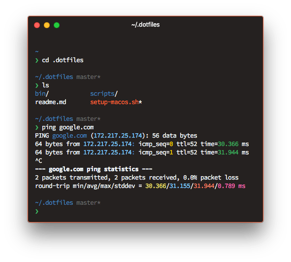

# .dotfiles

## Installation on fresh macOS

1. Open Terminal
2. Add ssh public key to Github account
3. `git clone git@github.com/simonhaenisch/.dotfiles` will ask to install XCode Developer Tools
4. Repeat the `git clone` command
5. `cd .dotfiles`
6. `./setup-macos.sh`
7. Check output for any failed brew/cask installs
8. Reboot

## Config/Check List

* Set Finder settings and view options in home folder (use as defaults)
* Battery: show percentage
* System Preferences > Sound: disable UI sounds, show in menu bar
* System Preferences > Bluetooth: disable, show in menu bar
* System Preferences > Dock: always prefer tabs
* Date & Time Preferences > Clock: show date
* Notes: sort by time created, font size level 4
* Open Photos: use iCloud library, wait for photos to download
* System Preferences > iCloud: disable optimizing storage for drive
* Set up Uebersicht widgets: `gclone simonhaenisch/uebersicht-widgets`
* Start f.lux: set location
* Configure the Unarchiver: select all formats, extract to same folder, move to trash afterwards
* Set up Dropbox
* `now login`

## Apps to manually install

* Newton
* Logix Pro X
* Pixelmator
* Graphic
* iWork
* Swift Note
